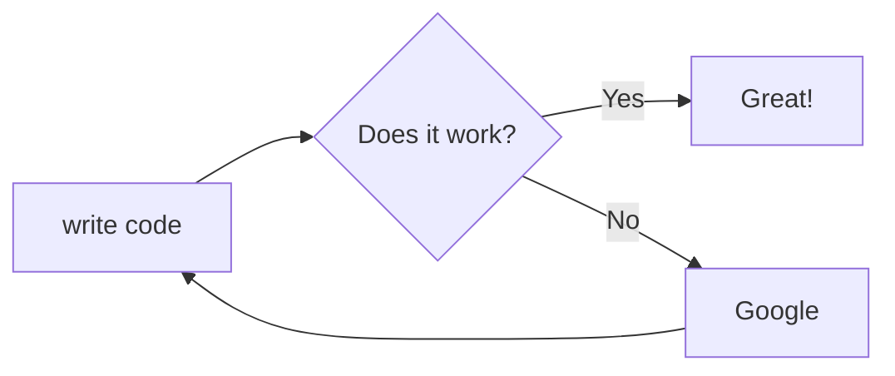

# Full stack test skeleton

Project could be tested with command `(start)` from the `user` namespace.

Please don't forget to:

- add to root `data/dev` folder or
  configure your XTDB connection
- install npm packages, eg `yarn`

before open your REPL.

---

## Services of Stack

Based on Clojure tools (deps.edn).

| Application services        |                     Libraries |
|:----------------------------|------------------------------:|
| **Database**                |            _XTDB + RocksDB_   |
| **State Management**        |          _Mount [clj/ cljs]_  |
| **Routing/ Interceptors**   |                  _Pedestal_   |
| **Frontend**                | _Shadow-cljs + Tailwind CSS_  |
| **Generate jar**            |                  _Uberdeps_   |
| **Test runner**             |                    _Kaocha_   |


What is contains:

- simple user auth/flow
- simple content at frontend
- simple tests

UML extensions:

- PlantUML, Mermaid installed for UML diags
- Extension: [puml, plantuml, puclass format] in this folder

## Installation

### From source

Rocksdb Installation on Ubuntu 18.04, based on
https://docs.desmos.network/fullnode/rocksdb-installation/

```shell
sudo apt install liblz4-dev
sudo apt-get install -y libgflags-dev libsnappy-dev zlib1g-dev libbz2-dev libzstd-dev
git clone https://github.com/facebook/rocksdb.git
sudo apt-get install g++
sudo apt-get install build-essential
cd rocksdb/
PORTABLE=1 make all
```

- Clone RocksDB `git clone https://github.com/facebook/rocksdb.git && cd rocksdb`
- Build Rocks `DBDEBUG_LEVEL=0 make shared_lib`
- Install RocksDB so that Desmos can access it `sudo make install-shared`
- Make sure the newly built library is linked correctly `sudo ldconfig`

```
make install DB_BACKEND=rocksdb
sudo apt install librocksdb-dev
```

Add to root folder in the .env `XTDB_ENABLE_BYTEUTILS_SHA1="true"`
OR Edit ~/.zshrc and add the line export `XTDB_ENABLE_BYTEUTILS_SHA1=true`.

More info at:
https://docs.xtdb.com/administration/1.22.0/configuring/ -> Environment Variables

Important: I need to start the repl from terminal (outside of IntelliJ), because that is just
a simulated terminal and will not pick up the env correctly, as confirmed by Cursive's author.
So, that is the "best practice" for using XTDB.

Mac M1 issue: https://github.com/xtdb/xtdb/issues/1518
`{org.rocksdb/rocksdbjni {:mvn/version "6.29.4.1"}}`

### Nix

Just run `nix-shell` and the project dependencies are defined in `shell.nix`.

## Test diagram setup

Mermaid diagram


