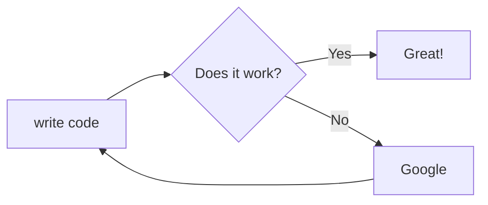

## Fullstack test skeleton 

<BR><BR>
Project could be test with command `(start)` from user namespace.
<BR><BR>

<hr style="border:1px solid white">

### Services of Stack 
Based on Clojure tools (deps.edn).
<BR><BR>


| Application services | Libraries |
|:----|-------:|
|  **Database**  	|  _XTDB + RocksDB_ 	|
|  **State Management** 	|  _Mount [clj/ cljs]_	|
|   **Routing/ Interceptors** 	|  _Pedestal_ 	|
|   **Frontend** 	|  _Shadow-cljs + Tailwind CSS_	|
|   **Generate jar** 	|  _Uberdeps_ 	|
|   **Test runner** 	|  _Koacha_ 	|
<BR>

What is contains:

- simple user auth/flow
- simple content at frontend
- simple tests
  
<BR>
UML extensions:

- PlantUML, Mermaid installed for UML diags
- Extension: [puml, plantuml, puclass format] in this folder
  
<BR>
<hr style="border:1px solid white">


### Installation

Rocksdb Installation on Ubuntu 18.04

```shell
sudo apt install liblz4-dev
sudo apt-get install -y libgflags-dev libsnappy-dev zlib1g-dev libbz2-dev libzstd-dev
git clone https://github.com/facebook/rocksdb.git
sudo apt-get install g++
sudo apt-get install build-essential
cd rocksdb/
PORTABLE=1 make all
```

https://docs.desmos.network/fullnode/rocksdb-installation/

- Clone RocksDB `git clone https://github.com/facebook/rocksdb.git && cd rocksdb`
- Build Rocks `DBDEBUG_LEVEL=0 make shared_lib`
- Install RocksDB so that Desmos can access it `sudo make install-shared`
- Make sure the newly built library is linked correctly `sudo ldconfig`
  
```
make install DB_BACKEND=rocksdb
sudo apt install librocksdb-dev
```

Add to root folder in the .env `XTDB_ENABLE_BYTEUTILS_SHA1="true"`
OR Edit ~/.zshrc and add the line export XTDB_ENABLE_BYTEUTILS_SHA1=true.
Check more info at: https://docs.xtdb.com/administration/1.22.0/configuring/ -> Environment Variables
Important comment: I need to start the repl from terminal (outside of IntelliJ), because that is just 
a simulated terminal and will not pick up the env in correct way. I talked about with Cursive' dev.
So, that is the "best practice" at XTDB.

Mac M1 issue: https://github.com/xtdb/xtdb/issues/1518
`{org.rocksdb/rocksdbjni {:mvn/version "6.29.4.1"}}`

### Test diagram setup

Mermaid diagram
